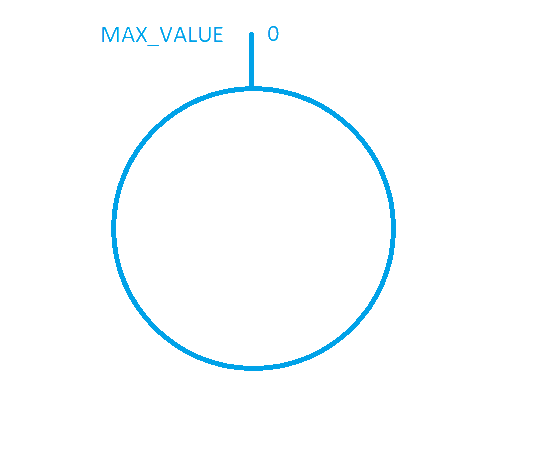

# consistent-hash

[Wikipedia](https://en.wikipedia.org/wiki/Consistent_hashing):
> In computer science, consistent hashing is a special kind of hashing technique such that when a hash table is resized, only `n/m` keys need to be remapped on average where `n` is the number of keys and `m` is the number of slots.
> In contrast, in most traditional hash tables, a change in the number of array slots causes nearly all keys to be remapped because the mapping between the keys and the slots is defined by a modular operation.

## Why consistent hashing

The easiest way to explain why we need consistent hashing is by example. 

Let's assume that we want to implement distributed cache on `n` nodes. The common way to partition  the data evenly is to use `mod n`. The node that will store the cache of objet `o` is:
```
long nodeIndex = hash(o) % n;
```
The function `hash` is standard hashing function like MD5, SHA1 ,etc.

This way of distributing cache values to different nodes work perfectly until we want to add or remove a node.
Let's take a look of the case when a node is removed (Similar logic is applied for the case when a node is added). The calculation of the index of the node that will cache the object `o` will change to:
```
long nodeIndex = hash(o) % (n-1);
```

Thus it is necessary to move almost all the objects from one node to another. This is a big waste of resources like CPU time/network/storage, etc. and not to mention that the nodes are swamped with move requests (self-inflicted DDoS).
What if we want to move just the objects from the removed node (rehashing them) and keep the others where they are? The **consistent hashing** solves this problem.

## How consistent hashing works?

Usually a hash function maps a value into key - numeric value between 0 and MAX_VALUE (2^31-1, 2^64-1,... it doesn't really matter).

The hash range represented as line.


Now imagine bending that line into a circle (hash ring). The start is still 0, which will be next to the end which is MAX_VALUE



All the hash values (keys) are placed on the ring clockwise. So on the picture bellow the `0 < k1 < k2 < k3 < k4 < MAX_VALUE` 


Now we need to distribute those values into buckets. In the example above each bucket will be stored into a single node of the distributed cache.
So from now on the buckets will be referred as nodes. Each node has a hash value which is plotted on the hash ring.
In the picture bellow the nodes are marked with red (N1, N2, N3). 

The hash values are `0 < N1 < k1 < N2 < k3 < k3 < k4 < N3 < MAX_VALUE`


The distribution of hash values to nodes is done clockwise. This means that k1 is assigned to the first clockwise node, which is N2.
k2,k3,k4 are assigned to first clockwise node, which is N3. Since there is no values between N3 and N1, then the N1 is empty. Or we can write down the distribution as:
`N1:empty; N2:k1; N3:k3,k4`

Removing a node is simply re-assigning all of its hash values to the next clockwise node, thus not modifying the hash values of other nodes.
So removing N2 means that all of it values (in this case only k1) will be assigned to the next clockwise node, which is N3.
So the hash values distribution is `N1:empty; N3:k1,k2,k3,k4` (picture bellow)


Now let's add a new node N2 (the one that we removed in the previous step). We find the node that is clockwise from N2, which is node N3, and we re-assing all the keys of N3 that are having value less than N2 (so the keys are counter-clockwise from N2)
So the distribution after (re-)adding N2 is `N1:empty; N2:k1; N3:k3,k4`


As you see it is possible to have a very non-uniform distribution of hash values between nodes if you don't have enough nodes, or the nodes values are not chosen wisely.
The solution is to introduce the idea of "virtual nodes". Each real node corresponds to one or more virtual nodes. Each virtual node has its own hash value.

So if we introduce 2 virtual nodes per physical node we could have the schema: 
- N1 has virtual nodes V1_1 and V1_2
- N2 has virtual nodes V2_1 and V2_2
- N3 has virtual nodes V3_1 and V3_3

The hash values are `0 < V1_1 < k1 < V2_1 < k3 < V1_2 < k3 < V3_2 < V2_2 < k4 < V3_1 < MAX_VALUE` which corresponds to the picture bellow:


Again all the hash values are stored in the first virtual node which is clockwise.
`V1_1:empty; V2_1:k1; V1_2:k2; V3_2:k3; V2_2:empty; V3_1:k4`
And since the virtual nodes are corresponds to physical node (`N1:V1_1,V1_2; N2:V2_1,V2_2; N3:V3_1,V3_2`) the value distribution to physical nodes is:
`N1:k2; N2:k1; N3:k3,k4`, which utilizes all the physical nodes.

## Implementation details

According to [wikipedia](https://en.wikipedia.org/wiki/Consistent_hashing#Complexity)

The virtual node hash keys can be stored in Balanced binary tree.

Asymptotic time complexities for `n`  nodes (or buckets) and `k` keys:

| Operation     | Classic hash table | Consistent hashing |
|---------------|-------------------|--------------------|
| add a node    | `O(k)`            | `O(k/n + log(n))`  |
| remove a node | `O(k)`            | `O(k/n + log(n))`  |
| add a key     | `O(1)`            | `O(log(n))`        |
| remove a key  | `O(1)`            | `O(log(n))`        |

The `O(k/n)`  is an average cost for redistribution of keys and the O(log(n)) complexity for consistent hashing comes from the fact that a binary search among nodes angles is required to find the next node on the ring.

In Java it is easier to use `TreeMap`; which is implemented with red-black-tree - a self-balancing binary search tree, that guaranteed `log(n)` time cost for the `containsKey`, `get`, `put` and `remove` operations.

## References
1. https://en.wikipedia.org/wiki/Consistent_hashing 
2. https://www.codeproject.com/Articles/56138/Consistent-hashing
3. https://github.com/Jaskey/ConsistentHash/blob/master/src/com/github/jaskey/consistenthash/ConsistentHashRouter.java


# Development guide
1. Install pre-commit (https://pre-commit.com/)
2. Install the pre-commit hook by executing `pre-commit install` inside project directory
3. Run against all files in the project: `pre-commit run --all-files`

# Building
```
mvn clean install
```
produces a jar file with MANIFEST containing main class and classpath.
All dependencies are copied to target/libs directory.

# Runing
```
mvn exec:java
```

or

```
cd target
java -jar xxxx.jar
```
